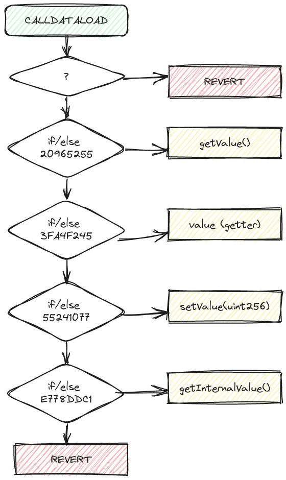
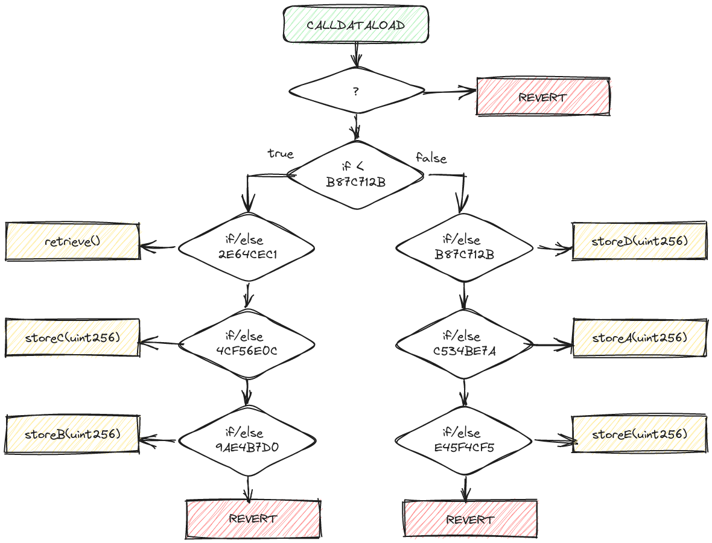
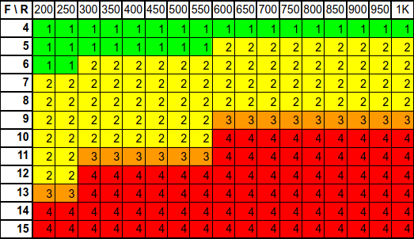
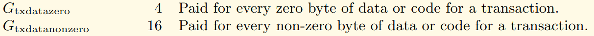

# Optimization on Ethereum: Make a Difference with Function Names 

<!-- TOC -->

- [Optimization on Ethereum: Make a Difference with Function Names](#optimization-on-ethereum-make-a-difference-with-function-names)
	- [TL;DR](#tldr)
	- [Introduction](#introduction)
	- [Selectors and signatures](#selectors-and-signatures)
	- [Introduction to the "Function Dispatcher"](#introduction-to-the-function-dispatcher)
		- [Operation](#operation)
		- [In Solidity](#in-solidity)
			- [Reminder on Solidity Function Visibilities](#reminder-on-solidity-function-visibilities)
			- [During Compilation](#during-compilation)
				- [Generated Code](#generated-code)
				- [Diagram](#diagram)
				- [Evaluation Order](#evaluation-order)
				- [Automatic Getter](#automatic-getter)
		- [In Yul](#in-yul)
	- [An increasing Complexity!](#an-increasing-complexity)
		- [Influence of the Runs Level](#influence-of-the-runs-level)
		- [Eleven Functions and a Thousand Runs](#eleven-functions-and-a-thousand-runs)
		- [Pseudo-code](#pseudo-code)
		- [Gas Cost Calculation](#gas-cost-calculation)
		- [Consumption Statistics](#consumption-statistics)
	- [Algorithms and Processing Order](#algorithms-and-processing-order)
		- [Linear Search runs = 200](#linear-search-runs--200)
		- [Fractional Search runs = 1000](#fractional-search-runs--1000)
	- [Optimizations](#optimizations)
		- [Execution Cost Optimization](#execution-cost-optimization)
		- [Intrinsic Cost Optimization](#intrinsic-cost-optimization)
			- [Examples of Gains on Intrinsic Costs:](#examples-of-gains-on-intrinsic-costs)
	- [Select0r](#select0r)
	- [Conclusions](#conclusions)
	- [Additional resources](#additional-resources)

<!-- /TOC -->


## TL;DR

1. *Cost optimization in gas is crucial for smart contracts on Ethereum.*
1. *The "function dispatcher" manages the execution of functions in smart contracts for EVMs.*
1. *Solidity compiler generates the "function dispatcher" for publicly exposed functions, whereas in Yul, it needs to be coded.*
1. *Signatures, hashes, and footprints of functions are determined by their names and parameter types.*
1. *The compiler's optimization setting and the number of functions impact the function selection algorithm.*
1. *Strategic renaming of functions optimizes gas costs and the selection order, influenced by footprint values.*


## Introduction

Cost optimization in gas is a key challenge in the development of smart contracts on the Ethereum blockchain, as each operation on Ethereum incurs a gas cost. This article is the translation of [Optimisation sur Ethereum : Faites la différence avec les noms de fonctions](https://medium.com/@franck.maussand/optimisation-sur-ethereum-faites-la-diff%C3%A9rence-avec-les-noms-de-fonctions-ba4692c9e39f) (🇫🇷).

**Reminder :**

- The **bytecode** represents a smart contract on the blockchain as a sequence of hexadecimal values.
- The Ethereum Virtual Machine (**EVM**) executes instructions by reading this bytecode during interactions with the contract.
- Each elementary instruction, encoded in one byte, is called an **opcode** and has a gas cost reflecting the resources required for its execution.
- A compiler translates this source code into bytecode executable by the EVM and provides elements such as the Application Binary Interface (ABI).
- An **ABI** defines how a contract's functions should be called and data exchanged, specifying the data types of arguments and the functions' signatures.

In this article, we will explore how simply naming your functions can influence the gas costs associated with your contract.

We will also discuss various optimization strategies, from the order of signature hashes to function renaming tricks, to reduce costs associated with interactions with your contracts.

**Précisions :**

This article is based on:
1. **Solidity** code (0.8.13, 0.8.17, 0.8.20, 0.8.22)
2. Compiled using the `solc` compiler
3. For **EVMs** on **Ethereum**

The following concepts will be covered:
- The signature: the numerical identifier of a function within the EVM.
- The "*function dispatcher*": the mechanism for selecting a function within a contract.
- And the function name as an argument (on the caller side).


## Selectors and signatures

The **signature** of a function as used with the Ethereum Virtual Machines (**EVMs**) (Solidity) consists of the concatenation of its name and parameter types (excluding return type and spaces).

The **function selector** is the unique identifier for the function. In Solidity, this involves the 4 most significant bytes (32 bits) of the result of hashing the function's signature with the [**Keccak-256 algorithm**](https://www.geeksforgeeks.org/difference-between-sha-256-and-keccak-256/).

This is based on the [**Solidity ABI specifications**](https://docs.soliditylang.org/en/develop/abi-spec.html#function-selector).

I would like to emphasize again that I am referring to the function selector for the **solc compiler for Solidity**, and this might not be the case for other languages like **Rust**, which operates on a completely different paradigm.

Considering parameter types is essential to differentiate functions with the same name but different parameters, as seen in the `safeTransferFrom` method of [**ERC721 tokens**](https://eips.ethereum.org/EIPS/eip-721).

However, the fact that only **four bytes** are retained for the function selector implies potential **hash collision risks** between two functions—a rare but existing risk despite over 4 billion possibilities (2^32).

As evidenced by the [**Ethereum Signature Database**](https://www.4byte.directory/signatures/?bytes4_signature=0xcae9ca51) with the following example:


| Function selectors | Signatures                                                   |
| ------------------ | ------------------------------------------------------------ |
| `0xcae9ca51`       | `onHintFinanceFlashloan(address,address,uint256,bool,bytes)` |
| `0xcae9ca51`       | `approveAndCall(address,uint256,bytes)`                      |

Fortunately, a simple Solidity contract with these two functions does not compile.

```
TypeError: Function signature hash collision for approveAndCall(address,uint256,bytes)
  --> contracts/HashCollision.sol:10:1:
   |
10 | contract HashCollision {
   | ^ (Relevant source part starts here and spans across multiple lines).
```

However, this remains problematic: Check out the challenge [**Hint-finance**](https://github.com/paradigmxyz/paradigm-ctf-2022/tree/main/hint-finance), in the [**Web3 Hacking: Paradigm CTF 2022**](https://medium.com/amber-group/web3-hacking-paradigm-ctf-2022-writeup-3102944fd6f5).


## Introduction to the "Function Dispatcher"

The "Function Dispatcher" (or function manager) in smart contracts written for the **EVMs** is a component of the contract that determines which function should be executed when someone interacts with the contract through an ABI.

In essence, the "Function Dispatcher" is like a conductor during calls to the functions of a smart contract. It ensures that the right functions are called when you perform specific actions on the contract.


### Operation

When interacting with a smart contract through a transaction, you specify which function you want to execute. The "*function dispatcher*" thus links the command to the specific function that will be called.

The function's signature is retrieved from the `calldata` during contract execution, and a `revert` occurs if the call cannot be matched with a function of the contract.

The selection mechanism is similar to that of a `switch/case` structure or a set of `if/else` statements.


### In Solidity

Applying what has been discussed above, we obtain, for the following function:

```solidity
function square(uint32 num) public pure returns (uint32) {
    return num * num;
}
```

The following signatures, hash, and selectors :

| Fonction  | square(uint32 num) public pure returns (uint32)                    |
| --------- | ------------------------------------------------------------------ |
| Signature | `square(uint32)` (*1*)                                             |
| Hash      | `d27b38416d4826614087db58e4ea90ac7199f7f89cb752950d00e21eb615e049` |
| Selector  | `d27b3841`                                                         |

(*1*) : *Keccak-256 online calculator : [`square(uint32)`](https://emn178.github.io/online-tools/keccak_256.html?input_type=utf-8&input=square(uint32))*

In Solidity, the "*function dispatcher*" is generated by the compiler, so there's no need to handle the coding of this complex task.

It only applies to functions in a contract that are accessible from outside the contract, thus having an access attribute of external and public.


#### Reminder on Solidity Function Visibilities

1. **External**: External functions are designed to be called from **outside the contract**, typically by other contracts or external accounts. It is the visibility to expose a public interface to your contract.

2. **Public**: Public functions are accessible from **both outside and inside the contract**.

3. **Internal** and **Private**: Internal and private functions can only be called from **inside the contract** (and contracts inheriting from it in the case of internal).

**Example #1**:

```solidity
pragma solidity 0.8.13;

contract MyContract {
    uint256 public value;
    uint256 internalValue;

    function setValue(uint256 _newValue) external {
        value = _newValue;
    }

    function getValue() public view returns (uint256) {
        return value;
    }

    function setInternalValue(uint256 _newValue) internal {
        internalValue = _newValue;
    }

    function getInternalValue() public view returns (uint256) {
        return internalValue;
    }
}
```

#### During Compilation

If we revisit the previous code used as an example, we obtain the following signatures and footprints:

| Fonctions                                              | Signatures                  | Keccak            | Selectors      |
| ------------------------------------------------------ | --------------------------- | ----------------- | -------------- |
| **`setValue(uint256 _newValue) external`**             | `setValue(uint256)`         | `55241077...ecbd` | **`55241077`** |
| **`getValue() public view returns (uint256)`**         | `getValue()`                | `20965255...ad96` | **`20965255`** |
| **`setInternalValue(uint256 _newValue) internal`**     | `setInternalValue(uint256)` | `6115694f...7ce1` | **`6115694f`** |
| **`getInternalValue() public view returns (uint256)`** | `getInternalValue()`        | `e778ddc1...c094` | **`e778ddc1`** |

(*The hashes from Keccak have been intentionally truncated*)

If we examine the ABI generated during compilation, the function `setInternalValue()` does not appear, which is expected as its visibility is `internal` (see above).

It is noteworthy in the ABI data, the reference to the `value` storage data, which is `public` (we will come back to this later).


##### Generated Code

Here is an excerpt of the "*function dispatcher*" code generated by the `solc` compiler (Solidity version: 0.8.13). It can be observed that the numerical value of the fingerprint is retrieved from the `calldata`, and this value is then compared to the different function signatures, allowing for a "jump" to the code of the desired function.

```assembly
tag 1
  JUMPDEST 
  POP 
  PUSH 4
  CALLDATASIZE 
  LT 
  PUSH [tag] 2
  JUMPI 
  PUSH 0
  CALLDATALOAD 
  PUSH E0
  SHR 
  DUP1 
  PUSH 20965255  // ◄ signature : getValue()
  EQ 
  PUSH [tag] getValue_0
  JUMPI 
  DUP1 
  PUSH 3FA4F245  // ◄ signature : value (automatic storage getters)
  EQ 
  PUSH [tag] 4
  JUMPI 
  DUP1 
  PUSH 55241077  // ◄ signature : setValue(uint256)
  EQ 
  PUSH [tag] setValue_uint256_0
  JUMPI 
  DUP1 
  PUSH E778DDC1  // ◄ signature : getInternalValue()
  EQ 
  PUSH [tag] getInternalValue_0
  JUMPI 
tag 2
  JUMPDEST 
  PUSH 0
  DUP1 
  REVERT
```

##### Diagram

In diagram form, one can better understand the selection mechanism, similar to that of a `switch/case` structure or a set of `if/else` statements.


<!--  -->


##### Evaluation Order

**Important**: The evaluation order of functions is not the same as their declaration order in the code!

| Evaluation Order | Order in the code  | Selectors   | Signatures                   |
| ---------------- | ------------------ | ----------- | ---------------------------- |
| 1                | **3**              | `20965255`  | `getValue()`                 |
| 2                | **1**              | `3FA4F245`  | `value` (*automatic getter*) |
| 3                | **2**              | `55241077`  | `setValue(uint256)`          |
| 4                | **4**              | `E778DDC1`  | `getInternalValue()`         |

Indeed, function signature evaluations are ordered by an ascending sort on their values.

`20965255` < `3FA4F245` < `55241077` < `E778DDC1`


##### Automatic Getter

The function with the selector `3FA4F245` is actually an automatic **getter** for the public data `value`, and it is generated by the compiler. In Solidity, the compiler automatically provides a public getter for any public storage variable.

```solidity
  uint256 public value;
```

We can find the selection footprint (`3FA4F245`) and the function (at `tag 4` address) of the automatic getter for this variable in the opcodes.

**Selector** :
```assembly
  DUP1 
  PUSH 3FA4F245  
  EQ 
  PUSH [tag] 4
  JUMPI 
```

**Fonction** :
```assembly
tag 4
  JUMPDEST 
  PUSH [tag] 11
  PUSH [tag] 12
  JUMP [in]
tag 11
  JUMPDEST 
  PUSH 40
  MLOAD 
  PUSH [tag] 13
  SWAP2 
  SWAP1 
  PUSH [tag] abi_encode_tuple_t_uint256__to_t_uint256__fromStack_reversed_0
  JUMP [in]
tag 13
  JUMPDEST 
  PUSH 40
  MLOAD 
  DUP1 
  SWAP2 
  SUB 
  SWAP1 
  RETURN
```

"`getter` actually has the same code as the `getValue()` function."

```assembly
tag getValue_0
  JUMPDEST 
  PUSH [tag] getValue_1
  PUSH [tag] getValue_3
  JUMP [in]
tag getValue_1
  JUMPDEST 
  PUSH 40
  MLOAD 
  PUSH [tag] getValue_2
  SWAP2 
  SWAP1 
  PUSH [tag] abi_encode_tuple_t_uint256__to_t_uint256__fromStack_reversed_0
  JUMP [in]
tag getValue_2
  JUMPDEST 
  PUSH 40
  MLOAD 
  DUP1 
  SWAP2 
  SUB 
  SWAP1 
  RETURN 
```

Demonstrating the futility of having the variable `value` with the `public` attribute in conjunction with the `getValue()` function, and also highlighting a weakness in the Solidity compiler `solc` that cannot merge the code of the two functions.

For those interested in delving deeper, here is a link to [**a detailed article**](https://medium.com/coinmonks/soliditys-cheap-public-face-b4e972e3924d) on `automatic storage getters` in Solidity.


### In Yul

Here is an excerpt from an example of a [**ERC20 contract**](https://docs.soliditylang.org/en/develop/yul.html#complete-erc20-example) entirely written in **Yul**.

While **Solidity** provides abstraction and readability, **Yul**, a lower-level language close to assembly, allows for much finer control over execution.

```yul
object "runtime" {
    code {
        // Protection against sending Ether
        require(iszero(callvalue()))

        // Dispatcher
        switch selector()
        case 0x70a08231 /* "balanceOf(address)" */ {
            returnUint(balanceOf(decodeAsAddress(0)))
        }
        case 0x18160ddd /* "totalSupply()" */ {
            returnUint(totalSupply())
        }
        case 0xa9059cbb /* "transfer(address,uint256)" */ {
            transfer(decodeAsAddress(0), decodeAsUint(1))
            returnTrue()
        }
        case 0x23b872dd /* "transferFrom(address,address,uint256)" */ {
            transferFrom(decodeAsAddress(0), decodeAsAddress(1), decodeAsUint(2))
            returnTrue()
        }
        case 0x095ea7b3 /* "approve(address,uint256)" */ {
            approve(decodeAsAddress(0), decodeAsUint(1))
            returnTrue()
        }
        case 0xdd62ed3e /* "allowance(address,address)" */ {
            returnUint(allowance(decodeAsAddress(0), decodeAsAddress(1)))
        }
        case 0x40c10f19 /* "mint(address,uint256)" */ {
            mint(decodeAsAddress(0), decodeAsUint(1))
            returnTrue()
        }
        default {
            revert(0, 0)
        }

        /* ---------- calldata decoding functions ----------- */
        function selector() -> s {
            s := div(calldataload(0), 0x100000000000000000000000000000000000000000000000000000000)
        }

  ...

```

It features the same cascading `if/else` structure as in the previous diagram.

Creating a contract **entirely in Yul** requires coding the "*function dispatcher*" manually, allowing one to choose the order of processing imprints and utilize algorithms beyond a simple cascading test suite.


## An increasing Complexity!

Now, here's a completely different example to illustrate that things are actually more complex!

Because depending on the **number of functions** and the **optimization level** (see: `--optimize-runs`), the Solidity compiler behaves differently!

**Example #2:**

```solidity
// SPDX-License-Identifier: GPL-3.0

pragma solidity 0.8.17;

contract Storage {

    uint256 numberA;
    uint256 numberB;
    uint256 numberC;
    uint256 numberD;
    uint256 numberE;


    // selector : C534BE7A
    function storeA(uint256 num) public {
        numberA = num;
    }

    // selector : 9AE4B7D0
    function storeB(uint256 num) public {
        numberB = num;
    }

    // selector : 4CF56E0C
    function storeC(uint256 num) public {
        numberC = num;
    }

    // selector : B87C712B
    function storeD(uint256 num) public {
        numberD = num;
    }

    // selector : E45F4CF5
    function storeE(uint256 num) public {
        numberE = num;
    }

    // selector : 2E64CEC1
    function retrieve() public view returns (uint256) {
        return Multiply( numberA, numberB, numberC, numberD);
    }

}
```

Here, the `storage` variables are `internal` (default attribute in Solidity), so no automatic getter will be added by the compiler.

And we indeed have 6 functions listed in the ABI JSON. The **6 following `public` functions** with their dedicated signatures:

| Fonctions                                      | Signatures        | Selectors      |
| ---------------------------------------------- | ----------------- | -------------- |
| **`storeA(uint256 num) public`**               | `storeA(uint256)` | **`C534BE7A`** |
| **`storeB(uint256 num) public`**               | `storeB(uint256)` | **`9AE4B7D0`** |
| **`storeC(uint256 num) public`**               | `storeC(uint256)` | **`4CF56E0C`** |
| **`storeD(uint256 num) public`**               | `storeD(uint256)` | **`B87C712B`** |
| **`storeE(uint256 num) public`**               | `storeE(uint256)` | **`E45F4CF5`** |
| **`retrieve() public view returns (uint256)`** | `retrieve()`      | **`2E64CEC1`** |

Based on the [**optimization level**](https://docs.soliditylang.org/en/develop/internals/optimizer.html) of the compiler, we get a different code for the "*function dispatcher*".

With a level of **200** (`--optimize-runs 200`), we obtain the type of code generated previously, with its cascading `if/else` statements.

```assembly
tag 1
  JUMPDEST 
  POP 
  PUSH 4
  CALLDATASIZE 
  LT 
  PUSH [tag] 2
  JUMPI 
  PUSH 0
  CALLDATALOAD 
  PUSH E0
  SHR 
  DUP1 
  PUSH 2E64CEC1
  EQ 
  PUSH [tag] retrieve_0
  JUMPI 
  DUP1 
  PUSH 4CF56E0C
  EQ 
  PUSH [tag] storeC_uint256_0
  JUMPI 
  DUP1 
  PUSH 9AE4B7D0
  EQ 
  PUSH [tag] storeB_uint256_0
  JUMPI 
  DUP1 
  PUSH B87C712B
  EQ 
  PUSH [tag] storeD_uint256_0
  JUMPI 
  DUP1 
  PUSH C534BE7A
  EQ 
  PUSH [tag] storeA_uint256_0
  JUMPI 
  DUP1 
  PUSH E45F4CF5
  EQ 
  PUSH [tag] storeE_uint256_0
  JUMPI 
  PUSH 0
  DUP1
  REVERT
```

However, with a higher level of `runs` (`--optimize-runs 300`)

```assembly
tag 1
  JUMPDEST
  POP
  PUSH 4
  CALLDATASIZE
  LT
  PUSH [tag] 2
  JUMPI
  PUSH 0
  CALLDATALOAD
  PUSH E0
  SHR
  DUP1
  PUSH B87C712B
  GT
  PUSH [tag] 9
  JUMPI
  DUP1
  PUSH B87C712B
  EQ
  PUSH [tag] storeD_uint256_0
  JUMPI
  DUP1
  PUSH C534BE7A
  EQ
  PUSH [tag] storeA_uint256_0
  JUMPI
  DUP1
  PUSH E45F4CF5
  EQ
  PUSH [tag] storeE_uint256_0
  JUMPI
  PUSH 0
  DUP1
  REVERT
tag 9
  JUMPDEST
  DUP1
  PUSH 2E64CEC1
  EQ
  PUSH [tag] retrieve_0
  JUMPI
  DUP1
  PUSH 4CF56E0C
  EQ
  PUSH [tag] storeC_uint256_0
  JUMPI
  DUP1
  PUSH 9AE4B7D0
  EQ
  PUSH [tag] storeB_uint256_0
  JUMPI
tag 2
  JUMPDEST
  PUSH 0
  DUP1
  REVERT
```

The opcodes and the execution flow with `--optimize-runs 300` are no longer the same, as shown in the following diagram.



It can be observed that the tests are "split" into two linear searches around a pivot value `B87C712B`, thereby reducing consumption for the less favorable cases of `storeB(uint256)` and `storeE(uint256)`.


### Influence of the Runs Level

Only **4 tests** for the functions `storeB(uint256)` and `storeE(uint256)`, instead of, respectively, **3 tests** and **6 tests** with the previous algorithm.

Determining the trigger for this type of optimization is more delicate; for example, the threshold for the number of functions happens to be 6 to trigger it with `--optimize-runs 284`, providing **two sets** of 3 linear test series.

When the number of functions is less than 4, the selection process is done through linear search. However, with five or more functions, the compiler splits the processing based on its optimization parameter.

[Tests on basic contracts](https://github.com/Laugharne/solc_runs_dispatcher) with 4 to 15 functions, using optimizations from 200 to 1000 executions, have demonstrated these thresholds.

The following table (resulting from these tests) shows the number of splits, indicating the number of linear searches.

**Record of the number of linear sequences based on runs level and the number of functions**



( *F : Number of functions / R : Runs level* )

Are these thresholds (associated with `runs` values) likely to evolve with subsequent versions of the `solc` compiler?


### Eleven Functions and a Thousand Runs

Let's delve into an example for a contract with 11 functions to visualize the impact on gas consumption.

With **11 eligible functions** and a higher `runs` level of `--optimize-runs 1000`, we transition from **two ranges** (one of 6 + one of 5) to **four ranges** (three of 3 + one of 2).

### Pseudo-code

This time, I won't reproduce the opcodes and the associated diagram. To clarify the explanation, here is the execution flow in the form of *pseudo-code*, resembling code in the **C** language.

```c
// [tag 1]
// 1 gas (JUMPDEST)
if( selector >= 0x799EBD70) {  // 22 = (3+3+3+3+10) gas
  if( selector >= 0xB9E9C35C) {  // 22 = (3+3+3+3+10) gas
    if( selector == 0xB9E9C35C) { goto storeF }  // 22 = (3+3+3+3+10) gas
    if( selector == 0xC534BE7A) { goto storeA }  // 22 = (3+3+3+3+10) gas
    if( selector == 0xE45F4CF5) { goto storeE }  // 22 = (3+3+3+3+10) gas
    revert()
  }
  // [tag 15]
  // 1 gas (JUMPDEST)
  if( selector == 0x799EBD70) { goto storeG }  // 22 = (3+3+3+3+10) gas
  if( selector == 0x9AE4B7D0) { goto storeB }  // 22 = (3+3+3+3+10) gas
  if( selector == 0xB87C712B) { goto storeD }  // 22 = (3+3+3+3+10) gas
  revert()
} else {
  // [tag 14]
  // 1 gas (JUMPDEST)
  if( selector >= 0x4CF56E0C) { // 22 = (3+3+3+3+10) gas
    if( selector == 0x4CF56E0C) { goto storeC }  // 22 = (3+3+3+3+10) gas
    if( selector == 0x6EC51CF6) { goto storeJ }  // 22 = (3+3+3+3+10) gas
    if( selector == 0x75A64B6D) { goto storeH }  // 22 = (3+3+3+3+10) gas
    revert()
  }
  // [tag 16]
  // 1 gas (JUMPDEST)
  if( selector == 0x183301E7) { goto storeI }    // 22 = (3+3+3+3+10) gas
  if( selector == 0x2E64CEC1) { goto retrieve }  // 22 = (3+3+3+3+10) gas
  revert()
}
```

The joints around the different "pivot" values are more clearly distinguished:
- With `799EBD70` as the **first pivot value**.
- Then `0x4CF56E0C` & `0xB9E9C35C` as **secondary pivot values**.


### Gas Cost Calculation

I used the code of a Solidity contract with **11 eligible functions** for the "*function dispatcher*" as a reference to estimate the gas cost of the selection, depending on whether it's a linear or fractioned search.

It's only the **cost of selection** in the "*function dispatcher*" and not the execution of functions that is estimated. We don't concern ourselves with what the function does or how much gas it consumes, nor with the code that extracts the function's signature by fetching data from the `calldata` area.

The estimation of gas costs for the used opcodes was done with the assistance of the following sites:
- [**Ethereum Yellow Paper**](https://ethereum.github.io/yellowpaper/paper.pdf) (Berlin version)
- [**EVM Codes - An Ethereum Virtual Machine Opcodes Interactive Reference**](https://www.evm.codes/?fork=shanghai)

The relevant **opcodes** in play for our purposes are as follows:

| Mnemonic           | Gas | Description                             |
| ------------------ | --- | --------------------------------------- |
| `JUMPDEST`         | 1   | Mark valid jump destination.            |
| `DUP1`             | 3   | Clone 1st value on stack                |
| `PUSH4 0xXXXXXXXX` | 3   | Push 4-byte value onto stack.           |
| `GT`               | 3   | Greater-than comparison.                |
| `EQ`               | 3   | Equality comparison.                    |
| `PUSH [tag]`       | 3   | Push 2-byte value onto stack.           |
| `JUMPI`            | 10  | Conditionally alter the program counter |


This allowed me to estimate the gas search costs for each function, for the [threshold values](#influence-of-the-runs-level) of `200` and `1000` runs, thus leading to different processing, sequential for `200 runs` and "fractionated" for `1000 runs`.  

| Signatures        | Selectors        | Gas (linear)    | Gas (splited)   |
| ----------------- | ---------------- | --------------- | --------------- |
| `storeI(uint256)` | `183301E7`       | **22 (*min*)**  | 69              |
| `retrieve()`      | `2E64CEC1`       | 44              | 91              |
| `storeC(uint256)` | `4CF56E0C` (*2*) | 66              | 69              |
| `storeJ(uint256)` | `6EC51CF6`       | 88              | 90              |
| `storeH(uint256)` | `75A64B6D`       | 110             | **112 (*max*)** |
| `storeG(uint256)` | `799EBD70` (*1*) | 132             | 68              |
| `storeB(uint256)` | `9AE4B7D0`       | 154             | 90              |
| `storeD(uint256)` | `B87C712B`       | 176             | **112 (*max*)** |
| `storeF(uint256)` | `B9E9C35C` (*2*) | 198             | **67 (*min*)**  |
| `storeA(uint256)` | `C534BE7A`       | 220             | 89              |
| `storeE(uint256)` | `E45F4CF5`       | **242 (*max*)** | 111             |

- (*1*): *First pivot value for 1000 runs*
- (*2*): *Secondary pivot values for 1000 runs*


### Consumption Statistics

If we take a closer look at the results of certain **statistics** on both types of search.

| \          | Linear | Fractional |
| ---------- | ------ | ---------- |
| Min        | **22** | 67         |
| Max        | 242    | **112**    |
| Average    | 132    | **88**     |
| Deviation  | 72,97  | **18,06**  |

We observe significant differences. Specifically, a lower **average** (-33%) with a considerably lower [**standard deviation**](https://en.wikipedia.org/wiki/Standard_deviation) of consumptions (4 times less) in favor of the fractional processing.


## Algorithms and Processing Order

Depending on the algorithm used by the Solidity compiler to generate the "*function dispatcher*," the processing order of functions will differ, both from the order of declaration in the source code and from the alphabetical order.


### Linear Search (runs = 200)

| #      | Signatures        | Selectors  |
| ------ | ----------------- | ---------- |
| **1**  | `storeI(uint256)` | `183301E7` |
| **2**  | `retrieve()`      | `2E64CEC1` |
| **3**  | `storeC(uint256)` | `4CF56E0C` |
| **4**  | `storeJ(uint256)` | `6EC51CF6` |
| **5**  | `storeH(uint256)` | `75A64B6D` |
| **6**  | `storeG(uint256)` | `799EBD70` |
| **7**  | `storeB(uint256)` | `9AE4B7D0` |
| **8**  | `storeD(uint256)` | `B87C712B` |
| **9**  | `storeF(uint256)` | `B9E9C35C` |
| **10** | `storeA(uint256)` | `C534BE7A` |
| **11** | `storeE(uint256)` | `E45F4CF5` |


The number of tests and the complexity of the process are proportional to the number of functions, in [**O(n)**](https://en.wikipedia.org/wiki/Time_complexity#List_of_time_complexities).


### Fractional Search (runs = 1000)

| #      | Signatures        | Selectors  |
| ------ | ----------------- | ---------- |
| **1**  | `storeF(uint256)` | `B9E9C35C` |
| **2**  | `storeG(uint256)` | `799EBD70` |
| **3**  | `storeI(uint256)` | `183301E7` |
| **4**  | `storeC(uint256)` | `4CF56E0C` |
| **5**  | `storeA(uint256)` | `C534BE7A` |
| **6**  | `storeJ(uint256)` | `6EC51CF6` |
| **7**  | `storeB(uint256)` | `9AE4B7D0` |
| **8**  | `retrieve()`      | `2E64CEC1` |
| **9**  | `storeE(uint256)` | `E45F4CF5` |
| **10** | `storeH(uint256)` | `75A64B6D` |
| **11** | `storeD(uint256)` | `B87C712B` |


This is not a [binary search](https://en.wikipedia.org/wiki/Binary_search_algorithm) in the strict sense of the term but rather a segmentation into groups of sequential tests around pivot values. However, in the end, the complexity is the same, in [O(log n)](https://en.wikipedia.org/wiki/Time_complexity#Table_of_common_time_complexities).

## Optimizations

If we assume that functions are called fairly (at the same frequency of use), their calls will not cost the same based on their signatures (and therefore their names). It's clear that the cost of selecting a call to these functions, regardless of the algorithm, is highly heterogeneous, and while it can be estimated, it cannot be imposed.

However, by strategically renaming functions, adding suffixes, for example, you can influence the results of function signatures and, consequently, the gas costs associated with these functions. This practice can optimize gas consumption in your smart contract, not only during function selection in the EVM but also, as we will see later, during transactions.

The cost of a transaction consists of two parts: the **intrinsic cost** (including those related to the useful data of transactions) and the **execution cost**. Our optimizations focus on these two costs.

You can find more information on the breakdown of transaction costs on [this page](https://www.lucassaldanha.com/transaction-execution-ethereum-yellow-paper-walkthrough-4-7/).

The combination of these two optimization approaches makes a **significant difference** by reducing gas consumption in smart contracts. This is particularly crucial in certain areas such as MEV (arbitrage) where optimization is vital.


### Execution Cost Optimization

To illustrate, modifying the function signature `square(uint32)` to `square_low(uint32)` changes the fingerprint to `bde6cad1` instead of `d27b3841`.

The lower value of the new fingerprint will prioritize the processing of calls to this function. This optimization can be crucial for highly complex smart contracts, reducing the time needed to search and select the correct function to call, resulting in gas savings and improved performance on the Ethereum blockchain.

The fact that the search is fractionated rather than linear complicates matters a bit. Depending on the number of functions and the compiler's optimization level, threshold values are more challenging to determine to choose new signatures based on the desired order.

### Intrinsic Cost Optimization

When you send a transaction on the Ethereum blockchain, you include data specifying which function of the smart contract you want to call and what the arguments of that function are. The gas cost of a transaction partly depends on the number of zero bytes in the transaction data.

As specified in the [**Ethereum Yellow Paper**](https://ethereum.github.io/yellowpaper/paper.pdf) (Berlin version),



- `Gtxdatazero` costs **4 gas** for each zero byte in the transaction.
- `Gtxdatanonzero` costs **16 gas** for each non-zero byte, which is **4 times more expensive**.

Thus, whenever a zero byte (`00`) is used in `msg.data` instead of a non-zero byte, it saves **12 gas**.

This EVM characteristic also impacts the consumption of other opcodes like `Gsset` and `Gsreset`. To illustrate, modifying the function signature `square(uint32)` to `square_Y7i(uint32)` changes the fingerprint to `00001878` instead of `d27b3841`.

The two most significant bytes of the fingerprint (`0000`) not only prioritize the **processing of the call** to this function, as seen earlier, but also consume **less gas** during data retrieval (**40** instead of **64**).

Here are some additional examples:

| Signatures (optimal)   | Selectors (optimal) | Signatures         | Selectors |
| ---------------------- | ------------------- | ------------------ | --------- |
| `deposit_ps2(uint256)` | 0000fee6            | `deposit(uint256)` | b6b55f25  |
| `mint_540(uint256)`    | 00009d1c            | `mint(uint256)`    | a0712d68  |
| `b_1Y()`               | 00008e0c            | `b()`              | 4df7e3d0  |

Similarly, being able to use signatures with **three zero-weight bytes** allows for consuming only **28 gas**.

For instance, [**`deposit278591A(uint)`**](https://emn178.github.io/online-tools/keccak_256.html?input_type=utf-8&input=deposit278591A(uint)) and [**`deposit_3VXa0(uint256)`**](https://emn178.github.io/online-tools/keccak_256.html?input_type=utf-8&input=deposit_3VXa0(uint256)), with respective signatures **`00000070`** and **`0000007e`**, achieve this optimization.

However, given that there can be only a unique selection value (signature), there can be only **one function in a contract** with a signature that has four zero bytes, even though multiple signatures may lead to this optimized signature **`00000000`**, allowing for consuming only **16 gas** (example with the following signature: [**`execute_44g58pv()`**](https://emn178.github.io/online-tools/keccak_256.html?input_type=utf-8&input=execute_44g58pv())).


#### Examples of Gains on Intrinsic Costs:

| Signatures          | Selectors  | # of zeros | Gas | Gain (gas) |
| ------------------- | ---------- | ---------- | --- | ---------- |
| `execute()`         | `61461954` | 0          | 64  | **0**      |
| `execute_5Hw()`     | `00af0043` | 1          | 52  | **8**      |
| `execute_mAX()`     | `0000eb63` | 2          | 40  | **24**     |
| `execute_6d4S()`    | `000000ae` | 3          | 28  | **36**     |
| `execute_44g58pv()` | `00000000` | 4          | 16  | **48**     |


## Select0r

I have developed **Select0r**, a tool written in **Rust** that allows you to rename your functions to optimize their calls. The program, given a function signature, will provide a list of alternative signatures with lower gas costs, enabling better ordering for the "*function dispatcher*."

[**GitHub - Laugharne/select0r**](https://github.com/Laugharne/select0r/tree/main)


## Conclusions

- Optimizing gas costs is a crucial aspect of designing efficient smart contracts on Ethereum.
  
- By paying attention to details such as the order of function signatures, the number of leading zeros in the hash, the order of function processing, and function renaming, you can significantly reduce the costs associated with your contract.

- **However,** be aware that this may reduce the user-friendliness and readability of your code.

- Optimization for execution may not be necessary for so-called administrative functions or those infrequently called.

- On the other hand, it should be prioritized for functions assumed to be the most frequently called (to be determined manually or statistically during practical tests).

- A single optimization may seem insignificant, especially compared to the overall cost of a transaction. However, a set of optimizations performed on a series of transactions makes all the difference, and it's not limited to optimizations on the "_function dispatcher_."

In the end, these optimizations can make the difference between a cost-effective contract and one that is gas-expensive.


--------

Credits: **[Franck Maussand](mailto:franck@maussand.net)**

*Special thanks to [**Igor Bournazel**](https://github.com/ibourn) for his suggestions and proofreading of this article.*

--------


## Additional resources

- Hash function :
  - [Hash function - Wikipedia](https://en.wikipedia.org/wiki/Hash_function)

- Keccak :
  - [SHA-3 - Wikipedia](https://en.wikipedia.org/wiki/SHA-3)
  - [Difference Between SHA-256 and Keccak-256 - GeeksforGeeks](https://www.geeksforgeeks.org/difference-between-sha-256-and-keccak-256/)

- Recherche dichotomique :
  - [Binary search algorithm - Wikipedia](https://en.wikipedia.org/wiki/Binary_search_algorithm)
  - [Big O notation - Wikipedia](https://en.wikipedia.org/wiki/Big_O_notation)

- References :
  - [Ethereum Yellow Paper](https://ethereum.github.io/yellowpaper/paper.pdf)
  - [Opcodes for the EVM](https://ethereum.org/en/developers/docs/evm/opcodes/)
  - [EVM Codes - An Ethereum Virtual Machine Opcodes Interactive Reference](https://www.evm.codes/?fork=shanghai)
  - [Operations with dynamic Gas costs](https://github.com/wolflo/evm-opcodes/blob/main/gas.md)
  - [Contract ABI Specification — Solidity 0.8.22 documentation](https://docs.soliditylang.org/en/develop/abi-spec.html#function-selector)
  - [Yul — Solidity 0.8.22 documentation](https://docs.soliditylang.org/en/latest/yul.html)
  - [Yul — Complete ERC20 Example](https://docs.soliditylang.org/en/develop/yul.html#complete-erc20-example)
  - [Using the Compiler — Solidity 0.8.22 documentation](https://docs.soliditylang.org/en/latest/using-the-compiler.html)
  - [The Optimizer — Solidity 0.8.22 documentation](https://docs.soliditylang.org/en/develop/internals/optimizer.html)

- Tools :
  - [GitHub - Laugharne/select0r](https://github.com/Laugharne/select0r/tree/main) ✨
  - [Keccak-256 Online](http://emn178.github.io/online-tools/keccak_256.html)
  - [Compiler Explorer](https://godbolt.org/)
  - [Solidity Optimize Name](https://emn178.github.io/solidity-optimize-name/)
  - [Ethereum Signature Database](https://www.4byte.directory/)
  - [GitHub - shazow/whatsabi: Extract the ABI (and other metadata) from Ethereum bytecode, even without source code.](https://github.com/shazow/whatsabi)

- Misc :
  - [Function Dispatching | Huff Language](https://docs.huff.sh/tutorial/function-dispatching/#linear-dispatching)
  - [Solidity’s Cheap Public Face](https://medium.com/coinmonks/soliditys-cheap-public-face-b4e972e3924d)
  - [Web3 Hacking: Paradigm CTF 2022 Writeup](https://medium.com/amber-group/web3-hacking-paradigm-ctf-2022-writeup-3102944fd6f5)
  - [paradigm-ctf-2022/hint-finance at main · paradigmxyz/paradigm-ctf-2022 · GitHub](https://github.com/paradigmxyz/paradigm-ctf-2022/tree/main/hint-finance)
  - [GitHub - Laugharne/solc_runs_dispatcher](https://github.com/Laugharne/solc_runs_dispatcher)
  - [WhatsABI? with Shazow - YouTube](https://www.youtube.com/watch?v=sfgassm8SKw)
  - [Ethereum Yellow Paper Walkthrough (4/7) - Transaction Execution](https://www.lucassaldanha.com/transaction-execution-ethereum-yellow-paper-walkthrough-4-7/)
